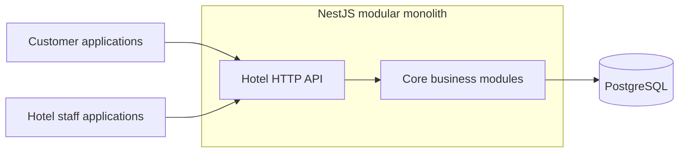
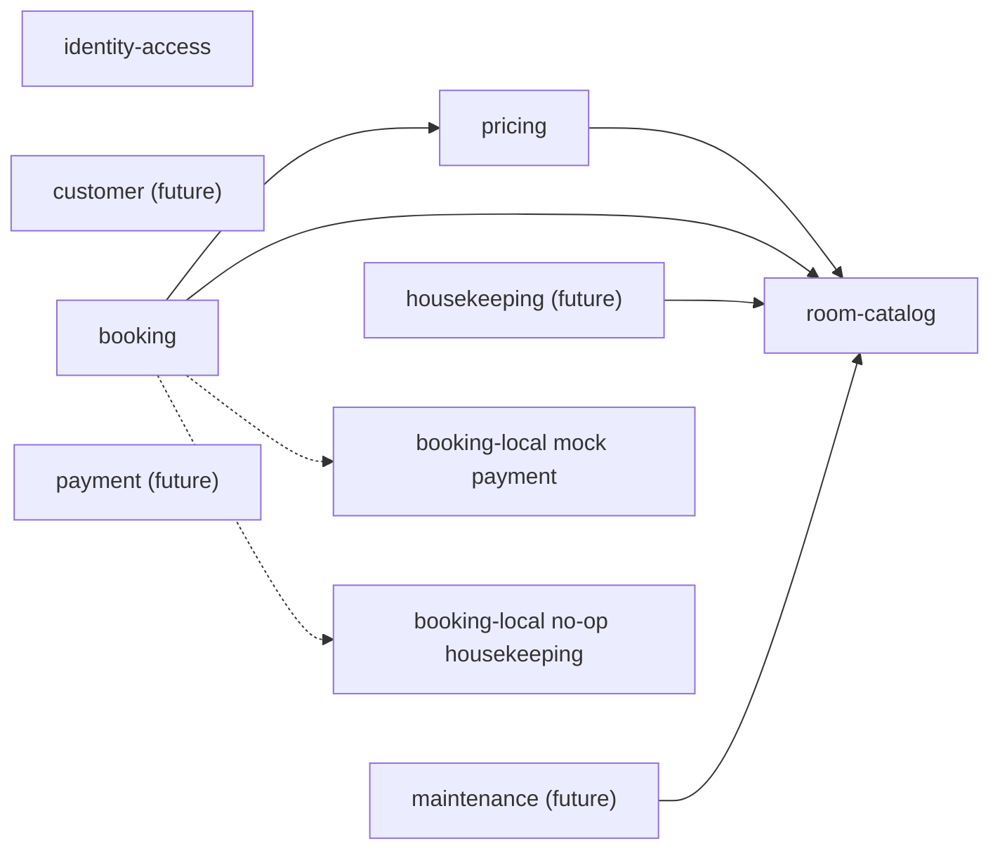

# Backend Architecture

This document defines the target architecture for Hotel API. See [`README.md`](../README.md) for the product scope, user roles, setup, and commands. Verify the source code and tests before treating a planned component as implemented.

## 1. System Context

Hotel API serves customer applications and hotel staff applications through HTTP APIs. It manages one hotel and stores operational data in one PostgreSQL database.



## 2. Architecture Style

The backend is a NestJS modular monolith. It runs as one application while separating business capabilities into explicit modules.

This structure keeps deployment and transactions simple while preserving module ownership. Each module owns its business rules and persistence code. Other modules use only its public contracts or published events.

The application has two internal architecture styles:

- `identity-access` uses Clean Architecture because authentication, account state, and credential handling require strict dependency boundaries.
- Every other business module uses a standard NestJS layered structure with a module, controller, service, repository, DTOs, and entities.

## 3. Technology Stack

| Concern            | Technology                                  |
| ------------------ | ------------------------------------------- |
| Framework          | NestJS 11                                   |
| Language           | TypeScript                                  |
| HTTP platform      | Express                                     |
| Database           | PostgreSQL                                  |
| ORM and migrations | TypeORM                                     |
| Authentication     | JWT access tokens and opaque refresh tokens |
| Authorization      | Role-based access control                   |
| API documentation  | OpenAPI with Swagger                        |
| Testing            | Jest                                        |

## 4. Module Landscape

| Module                  | Responsibility                                                       | Owned information                                                 |
| ----------------------- | -------------------------------------------------------------------- | ----------------------------------------------------------------- |
| `identity-access`       | Authentication, accounts, account roles, and credentials             | Accounts, roles, password hashes, and account tokens              |
| `customer` (future)     | Customer profiles and personal information                           | Contact and identification details                                |
| `room-catalog`          | Room types, physical rooms, facilities, floors, and room status      | Room types, facilities, rooms, and operational status             |
| `pricing`               | Nightly prices and stay quotes for room types                        | Date-ranged room rates                                            |
| `booking`               | Availability, reservations, mock payment, room assignment, and stays | Reservations, reservation items, price snapshots, and assignments |
| `payment` (future)      | Payments, refunds, and payment status                                | Immutable payment transactions                                    |
| `housekeeping` (future) | Cleaning task creation, assignment, and progress                     | Housekeeping tasks                                                |
| `maintenance` (future)  | Maintenance request creation, assignment, and progress               | Maintenance requests and tasks                                    |

### Dependency Overview

Solid arrows represent synchronous calls through public module contracts. Dotted arrows represent Booking-local in-process mock events.



`identity-access` protects HTTP routes and creates the authenticated-user context. Business modules read that context at the presentation boundary and pass the required account or customer identifiers into their application logic.

The approved Booking MVP does not depend on implemented Customer, Payment, Housekeeping, or Maintenance modules. Online Customer operations use the authenticated account ID as a mock Customer ID, while Receptionist creation accepts a Customer UUID. Booking publishes local payment and refund events to an always-successful mock handler and publishes check-out events to a no-op Housekeeping handler. The module landscape keeps Customer, Payment, Housekeeping, and Maintenance as future target modules rather than claiming that they are implemented dependencies.

## 5. Module Structures

### 5.1 `identity-access`

The `identity-access` module uses four Clean Architecture layers:

```text
src/modules/identity-access/
|-- domain/
|   |-- entities/
|   |-- value-objects/
|   `-- errors/
|-- application/
|   |-- commands/
|   |-- queries/
|   `-- ports/
|-- infrastructure/
|   |-- persistence/
|   |-- security/
|   `-- email/
|-- presentation/
|   `-- http/
`-- identity-access.module.ts
```

| Layer          | Responsibility                                                            | Dependency rule                        |
| -------------- | ------------------------------------------------------------------------- | -------------------------------------- |
| Domain         | Account rules, entities, value objects, and domain errors                 | Depends on no framework or outer layer |
| Application    | Use cases, commands, queries, and ports                                   | Depends on the domain                  |
| Infrastructure | TypeORM persistence, token services, password hashing, and email adapters | Implements application ports           |
| Presentation   | Controllers, request DTOs, guards, and response DTOs                      | Invokes application use cases          |

`identity-access.module.ts` is the composition root for this module. It wires ports to infrastructure adapters without moving infrastructure concerns into the domain or application layers.

### 5.2 Standard Business Modules

Every other business module uses the following structure:

```text
src/modules/<module>/
|-- dto/
|-- entities/
|-- repositories/
|-- <module>.controller.ts
|-- <module>.service.ts
`-- <module>.module.ts
```

| Component  | Responsibility                                                                 |
| ---------- | ------------------------------------------------------------------------------ |
| Module     | Declares providers, controllers, imports, and public exports                   |
| Controller | Handles HTTP input and delegates work to the service                           |
| Service    | Applies business rules and coordinates repositories or public module contracts |
| Repository | Reads and writes the module's TypeORM entities                                 |
| DTO        | Defines and validates API input and output                                     |
| Entity     | Maps the module's data to PostgreSQL through TypeORM                           |

Controllers remain thin. Business decisions belong in the service, except for `identity-access`, where they belong in domain entities and application use cases.

## 6. Module Boundaries and Communication

### Public Contracts

A module may expose an intentional public service or contract through its NestJS module. Business logic and service-to-service calls must not import another module's controller, TypeORM entity, repository, or internal service. An explicitly approved persistence entity may define a TypeORM relationship to another module's entity when the shared-database foreign key is part of the design.

Public contracts use module-owned request and response types. They expose business operations instead of persistence details.

### Synchronous Calls

Use synchronous calls when the caller needs a result before completing its operation. Examples include:

- `pricing` validates active Room Types through `room-catalog`.
- `booking` obtains Room Type capacity and operational data through `room-catalog`.
- `booking` requests bulk stay quotes through `pricing`.

Booking passes its active TypeORM `EntityManager` to the Room Catalog and Pricing public contracts when a Reservation write requires one transaction. Each called module obtains its own repositories from that manager. Booking does not import another module's entities or repositories.

### In-Process Events

Use in-process events for Booking-local mock payment, refund, and post-check-out handling. Booking commits its required state before publishing an event. The mock Payment handler always publishes a matching success event, and the mock Housekeeping handler performs no work.

The approved MVP event bus stores no events and has no outbox, queue, retry framework, or delivery guarantee. Repeated payment and refund operations republish the same request ID. Event payloads contain identifiers and required facts, not TypeORM entities.

### Transactions

The application service that coordinates a write operation defines its transaction boundary. All Booking writes required to accept a Reservation must complete atomically, including the final availability and price checks.

Booking application services call `DataSource.transaction()` and pass the transaction manager to Booking repositories and participating Room Catalog and Pricing contracts. Repositories do not open nested transactions. Events are published only after the state required by the event has committed.

## 7. Data Architecture

The application uses one PostgreSQL database and TypeORM. Sharing a database does not remove module ownership.

- Each module owns its tables, TypeORM entities, repositories, and schema changes.
- A module stores another module's identifier when it needs a reference. Business logic uses public contracts rather than another module's TypeORM entity. An explicitly approved persistence mapping may import the referenced entity only to define its TypeORM relationship.
- Schema changes use TypeORM migrations.
- A migration changes only the tables owned by its module unless one coordinated change must update both sides of a relationship.
- Services use database transactions for multi-write operations that must succeed or fail together.
- Availability and pricing are rechecked inside the Booking write transaction before the system accepts a reservation.

## 8. API and Cross-Cutting Concerns

See [`http-conventions.md`](http-conventions.md) for source-backed routing, response envelope, pagination, Swagger, and exception-filter behavior.

### Request Flow

The common HTTP flow is:

```text
Request -> authentication and role guards -> DTO validation -> controller
        -> service or use case -> repository -> response interceptor
```

Exceptions leave the normal flow through a centralized exception filter.

### Responses

Successful responses use a consistent envelope:

```json
{
  "data": {},
  "meta": {
    "requestId": "request identifier",
    "timestamp": "ISO 8601 timestamp"
  }
}
```

Paginated responses add pagination information to `meta`. Controllers return business response DTOs, not TypeORM entities.

### Errors

The `identity-access` domain and application errors remain independent from HTTP. Its presentation layer maps known errors to stable HTTP status codes and error codes.

Standard NestJS business module services may throw NestJS HTTP exception subclasses directly. Their exception payloads use stable, machine-readable error codes and safe client messages. Unknown errors return a generic internal error without stack traces, SQL details, internal class names, or provider responses.

### Validation and API Documentation

Request DTOs define validation rules. Swagger decorators document routes, request DTOs, response DTOs, authentication requirements, and error responses.

### Logging

Structured logs include the request identifier and the operation context. Logs exclude passwords, authentication tokens, cookies, payment credentials, and customer identification details.

## 9. Security Architecture

The `identity-access` module owns authentication and account roles.

- Passwords are stored as Argon2id hashes.
- Access tokens are signed JWTs and are verified by a Passport JWT strategy.
- Refresh, email-verification, and password-reset tokens are opaque credentials stored as deterministic lookup hashes.
- Protected routes obtain account identity and role from the authenticated request context.
- RBAC uses the role stored on the account.
- Administrators can create accounts and change an account's role.
- Customer operations derive the customer identity from the authenticated context and enforce resource ownership in business logic.
- Public routes are marked explicitly. Other routes require authentication.
- Error messages and logs never expose credentials or sensitive account data.

## 10. Testing Strategy

| Test type                   | Focus                                                                    | Location                                 |
| --------------------------- | ------------------------------------------------------------------------ | ---------------------------------------- |
| Domain unit test            | `identity-access` entities, value objects, and business invariants       | Beside domain source files               |
| Application unit test       | `identity-access` use cases with mocked ports                            | Beside application source files          |
| Service unit test           | Business rules in standard NestJS modules                                | Beside service source files              |
| Repository integration test | TypeORM mapping, queries, and transactions against PostgreSQL            | Beside repository tests or under `test/` |
| E2E test                    | HTTP validation, authentication, RBAC, ownership, and complete workflows | `test/`                                  |

Tests cover successful behavior, authorization failures, invalid state changes, date boundaries, availability conflicts, payment changes, and room-status transitions.

The approved Booking MVP completion scope requires controller and service unit tests only. Booking repository, migration, DTO, module-wiring, event-bus, PostgreSQL integration, and E2E tests remain outside that feature scope.

## 11. Key Architecture Rules

| Area                | Rule                                                                                                          |
| ------------------- | ------------------------------------------------------------------------------------------------------------- |
| Hotel scope         | Model the single hotel managed by the system.                                                                 |
| `identity-access`   | Keep Clean Architecture dependencies directed toward the domain.                                              |
| Other modules       | Use the standard NestJS layered structure.                                                                    |
| Module access       | Communicate through public contracts and in-process events.                                                   |
| Persistence         | Keep TypeORM entities module-owned. Store migrations centrally and scope each migration to its owning module. |
| Booking consistency | Recheck availability and pricing in the Booking write transaction.                                            |
| Booking mocks       | Keep Customer identity, Payment events, and Housekeeping handling local and minimal for the approved MVP.     |
| Authorization       | Derive account-role RBAC and ownership information from the authenticated context.                            |
| API output          | Return response DTOs through the `{ data, meta }` envelope.                                                   |
