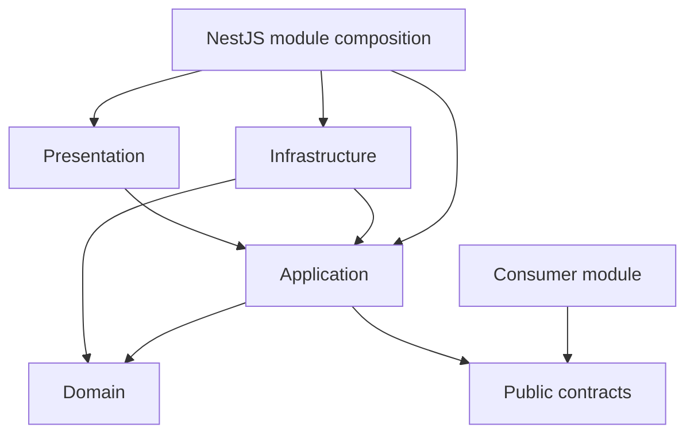

# Code Structure

## 1. Source Layout

```text
src/
├── app.module.ts
├── main.ts
├── modules/
│   ├── identity-access/
│   ├── customer/
│   ├── room-catalog/
│   ├── pricing/
│   ├── inventory-availability/
│   ├── reservation/
│   ├── stay/
│   ├── payment/
│   ├── invoice/
│   ├── housekeeping/
│   ├── maintenance/
│   ├── notification/
│   └── reporting/
└── shared/
```

Business code belongs under `src/modules`. The root application module is the composition root and must not contain business logic.

## 2. Module Types

| Module type | Modules                                                                                                   | Structure                     |
| ----------- | --------------------------------------------------------------------------------------------------------- | ----------------------------- |
| Complex     | `pricing`, `inventory-availability`, `reservation`, `stay`, `payment`, `invoice`                          | Full Clean Architecture       |
| Standard    | `identity-access`, `customer`, `room-catalog`, `housekeeping`, `maintenance`, `notification`, `reporting` | Simplified Clean Architecture |

A standard module must move to the full structure when it gains complex invariants, multiple aggregates, several external adapters, or multi-step application workflows.

## 3. Complex Module Structure

```text
reservation/
├── index.ts
├── contracts/
│   ├── events/
│   ├── reservation.contract.ts
│   ├── reservation.tokens.ts
│   └── index.ts
├── domain/
│   ├── aggregates/
│   ├── entities/
│   ├── value-objects/
│   ├── events/
│   ├── services/
│   └── errors/
├── application/
│   ├── commands/
│   ├── queries/
│   ├── ports/
│   │   ├── inbound/
│   │   └── outbound/
│   └── mappers/
├── infrastructure/
│   ├── persistence/
│   │   └── typeorm/
│   │       ├── entities/
│   │       ├── repositories/
│   │       ├── mappers/
│   │       └── migrations/
│   ├── messaging/
│   └── adapters/
├── presentation/
│   └── http/
│       ├── controllers/
│       ├── dto/
│       └── presenters/
└── reservation.module.ts
```

| Area             | Responsibility                                                                                     |
| ---------------- | -------------------------------------------------------------------------------------------------- |
| `contracts`      | Public application interfaces, injection tokens, public data shapes, and integration-event schemas |
| `domain`         | Aggregates, entities, value objects, domain services, domain events, invariants, and domain errors |
| `application`    | Use-case orchestration, commands, queries, transaction requests, and outbound ports                |
| `infrastructure` | TypeORM adapters, external-provider adapters, messaging adapters, and technical implementations    |
| `presentation`   | HTTP controllers, request and response DTOs, transport validation, and response mapping            |
| `*.module.ts`    | NestJS dependency wiring and the module's exported public contract providers                       |

Repository interfaces belong in `application/ports/outbound`. Domain code receives aggregates or domain values and does not know how they are loaded or stored.

## 4. Standard Module Structure

```text
room-catalog/
├── index.ts
├── contracts/
│   ├── room-catalog.contract.ts
│   ├── room-catalog.tokens.ts
│   ├── events.ts
│   └── index.ts
├── domain/
│   ├── room.ts
│   ├── room-type.ts
│   └── room-status.ts
├── application/
│   ├── room-catalog.service.ts
│   └── room-catalog.repository.port.ts
├── infrastructure/
│   └── typeorm/
│       ├── room.orm-entity.ts
│       ├── room-type.orm-entity.ts
│       ├── room-catalog.repository.ts
│       ├── room-catalog.mapper.ts
│       └── migrations/
├── presentation/
│   └── http/
│       ├── room-catalog.controller.ts
│       └── dto/
└── room-catalog.module.ts
```

The standard structure keeps the same dependency direction as a complex module but uses fewer nested folders. It does not permit controllers to access repositories or TypeORM entities directly.

## 5. Dependency Direction



| Area                    | Allowed imports                                                   |
| ----------------------- | ----------------------------------------------------------------- |
| `contracts`             | Its own files and approved shared primitives                      |
| `domain`                | Its own domain and approved shared domain primitives              |
| `application`           | Its own domain, contracts, and shared application abstractions    |
| `infrastructure`        | Its own application, domain, contracts, and shared infrastructure |
| `presentation`          | Its own application, contracts, and shared presentation utilities |
| Module composition file | All layers inside its module and approved dependency modules      |
| Another business module | Only the provider's root public entry point                       |

Domain code must not import NestJS, TypeORM, transport DTOs, configuration libraries, or external SDKs. Application code may use NestJS dependency-injection decorators but must not depend on HTTP or TypeORM APIs.

## 6. Public Contract Surface

- Every module has one root `index.ts` that exports its NestJS module class and its supported contracts.
- `contracts/index.ts` exports public interfaces, tokens, data shapes, and integration events to the root entry point.
- Other modules import only from the provider's root entry point.
- Public contracts use injection tokens so consumers depend on interfaces rather than implementation classes.
- Integration-event schemas are public contracts; internal domain events remain under `domain/events`.
- Application handlers and services remain internal unless a purpose-built contract exposes their behavior.
- The root entry point must not export domain, application, infrastructure, or presentation internals.
- Additional module-wide barrel files are prohibited.
- A public contract must not re-export domain aggregates, TypeORM entities, repositories, or transport DTOs.

## 7. NestJS Module Composition

Each `*.module.ts` file is a composition root for one business module. It:

- Registers controllers, application handlers, and infrastructure adapters.
- Binds application ports to infrastructure implementations.
- Imports only modules allowed by the dependency matrix.
- Exports only providers identified by public contract tokens.
- Keeps TypeORM feature registration inside the module that owns the mapped entities.

`AppModule` imports business modules but does not re-export their providers or coordinate business workflows. Global modules are limited to technical infrastructure such as configuration, logging, database setup, and correlation context.

`forwardRef()` must not be used to bypass a circular business dependency. A cycle requires redesigning the module contracts or moving orchestration to the initiating module.

## 8. TypeORM Placement

- TypeORM entities are persistence models and live only under `infrastructure`.
- Domain entities and TypeORM entities are separate classes connected by explicit mappers.
- Repository implementations return domain objects or application read models, never TypeORM entities.
- `BaseEntity` and the Active Record pattern are prohibited.
- Cross-module TypeORM relations are prohibited. A module stores another module's identifier as a scalar column.
- Query builders and raw SQL remain inside the owning module's persistence adapters.
- Module migrations live beside the module's TypeORM mappings. Shared-infrastructure migrations live under shared infrastructure.
- Database schema synchronization is disabled. Every schema change uses a reviewed migration.
- Repositories obtain the active transaction manager from the shared transaction context defined by `docs/architecture/module-communication.md`.
- TypeORM subscribers must not contain business rules or publish integration events implicitly.

The shared TypeORM data source discovers module entities and migrations, but it does not own their business schemas.

## 9. Shared Code

```text
shared/
├── domain/
├── application/
├── infrastructure/
│   ├── persistence/
│   ├── messaging/
│   └── observability/
└── presentation/
```

The `shared` directory contains stable technical capabilities or deliberately shared primitives. It must not become a general-purpose location for code that has no clear owner.

- `shared/domain` contains only approved primitives with identical meaning across modules.
- `shared/application` contains technical ports such as clock, identifier generation, and transaction runner abstractions.
- `shared/infrastructure` contains database bootstrap, transaction context, outbox infrastructure, logging, and external technical clients.
- `shared/presentation` contains transport-level filters, interceptors, and response utilities.
- Shared code must not import a business module.
- Business entities, repositories, use cases, and module-specific DTOs are prohibited in `shared`.

Code used by only one or two modules remains in its owning module until a stable shared abstraction is demonstrated.

## 10. Structural Enforcement

- New business capabilities are created under `src/modules`; global `controllers`, `services`, `entities`, and `repositories` folders are prohibited.
- ESLint restricted-import rules enforce layer direction and cross-module contract-only imports.
- Architecture tests detect imports of another module's internal paths.
- NestJS module imports must match the synchronous dependency matrix in `docs/architecture/module-boundaries.md`.
- Dynamic imports, path aliases, or re-export files must not be used to bypass a boundary rule.
