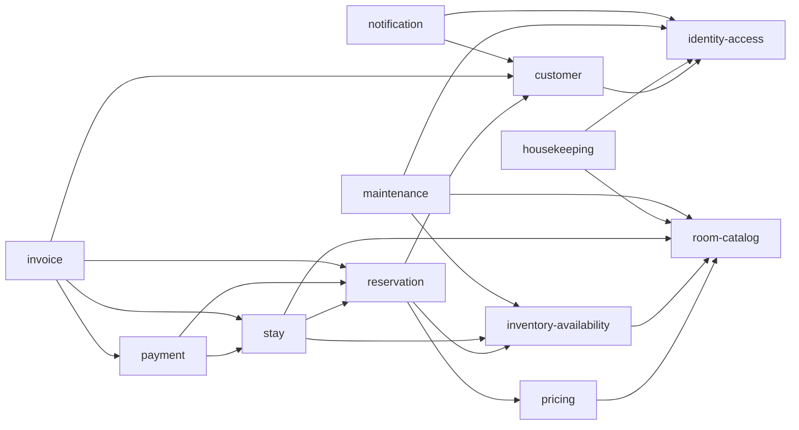

# Module Boundaries

## 1. Boundary Rules

- Every business record has one owning module.
- A module may store another module's identifier or an immutable snapshot, but it must not map or update another module's tables.
- Cross-module calls use exported application contracts. Controllers, TypeORM entities, repositories, and internal services are never public contracts.
- Published events describe completed business changes and contain only the data required by consumers.
- Read projections owned by `reporting` or `inventory-availability` are derived data and are not authoritative business records.
- Only dependencies listed in this document are allowed.

## 2. Module Catalog

### 2.1 `identity-access`

- **Owns:** user accounts, credentials, refresh sessions, role definitions, and role assignments.
- **Provides:** authentication, token refresh, account lifecycle management, role assignment, and account lookup contracts.
- **Publishes:** `UserAccountCreated`, `UserAccountStatusChanged`, and `UserRolesChanged`.
- **Excludes:** customer profiles, reservations, staff task assignments, and business resource ownership.

### 2.2 `customer`

- **Owns:** customer profiles, contact details, identification details, and optional links to identity accounts.
- **Provides:** customer creation, profile update, account linking, and customer lookup contracts.
- **Publishes:** `CustomerCreated`, `CustomerUpdated`, and `CustomerAccountLinked`.
- **Excludes:** user credentials, reservation records, payment records, and authoritative reservation history.

### 2.3 `room-catalog`

- **Owns:** room types, physical rooms, room numbers, floors, capacities, facilities, and current operational room status.
- **Provides:** room type and room management, catalog lookup, and operational room-status transition contracts.
- **Publishes:** `RoomTypeChanged`, `RoomChanged`, and `RoomOperationalStatusChanged`.
- **Excludes:** dated prices, sellable inventory, reservations, cleaning tasks, and maintenance work orders.

### 2.4 `pricing`

- **Owns:** effective-dated prices for each room type and the rules required to produce a price quote.
- **Provides:** price creation, price update, and room-type quote contracts.
- **Publishes:** `RoomTypePriceChanged`.
- **Excludes:** room availability, reservation price snapshots, payments, and invoices.

### 2.5 `inventory-availability`

- **Owns:** inventory holds, committed allocations, released allocations, availability blocks, and derived sellable-inventory projections.
- **Provides:** availability search, hold, commit, release, maintenance-block creation, and maintenance-block release contracts.
- **Publishes:** `InventoryHeld`, `InventoryCommitted`, `InventoryReleased`, `AvailabilityBlockCreated`, and `AvailabilityBlockReleased`.
- **Excludes:** reservation records, room prices, physical-room assignments, cleaning tasks, and maintenance work orders.

### 2.6 `reservation`

- **Owns:** reservations, reserved room-type lines, stay dates, guest counts, reservation status, cancellation details, price snapshots, and inventory-allocation references.
- **Provides:** reservation creation, confirmation, update, cancellation, and lookup contracts.
- **Publishes:** `ReservationCreated`, `ReservationConfirmed`, `ReservationUpdated`, and `ReservationCancelled`.
- **Excludes:** sellable inventory, physical-room assignments, payment transactions, and invoices.

### 2.7 `stay`

- **Owns:** stays, physical-room assignments, check-in records, check-out records, and actual arrival and departure times.
- **Provides:** room assignment, check-in, check-out, and stay lookup contracts.
- **Publishes:** `RoomAssigned`, `GuestCheckedIn`, and `GuestCheckedOut`.
- **Excludes:** reservation terms, room operational status, housekeeping tasks, payment transactions, and invoices.

### 2.8 `payment`

- **Owns:** deposits, payments, refunds, payment methods, transaction references, idempotency keys, and payment status.
- **Provides:** deposit recording, payment recording, refund recording, payment-status update, and payment-summary lookup contracts.
- **Publishes:** `DepositRecorded`, `PaymentRecorded`, `RefundRecorded`, and `PaymentStatusChanged`.
- **Excludes:** reservation pricing, invoice documents, invoice numbering, and invoice status.

### 2.9 `invoice`

- **Owns:** invoice numbers, issued invoice snapshots, line items, totals, document metadata, and invoice status.
- **Provides:** invoice issue, invoice lookup, and invoice document retrieval contracts.
- **Publishes:** `InvoiceIssued`.
- **Excludes:** deposits, payments, refunds, and payment-provider communication.

### 2.10 `housekeeping`

- **Owns:** cleaning tasks, task assignments, cleaning status, notes, and task timestamps.
- **Provides:** task creation, assignment, start, completion, and task lookup contracts.
- **Publishes:** `HousekeepingTaskCreated`, `HousekeepingTaskAssigned`, `RoomCleaningStarted`, and `RoomCleaningCompleted`.
- **Excludes:** room operational status, stays, maintenance work, and availability blocks.

### 2.11 `maintenance`

- **Owns:** maintenance requests, work orders, staff assignments, planned work periods, status, notes, and availability-block references.
- **Provides:** request creation, assignment, start, completion, cancellation, and maintenance lookup contracts.
- **Publishes:** `MaintenanceRequested`, `MaintenanceAssigned`, `MaintenanceStarted`, and `MaintenanceCompleted`.
- **Excludes:** physical-room definitions, room operational status, and authoritative availability blocks.

### 2.12 `notification`

- **Owns:** notification templates, notification messages, delivery channels, delivery status, and delivery attempts.
- **Provides:** notification queueing and delivery-status lookup contracts.
- **Publishes:** `NotificationQueued`, `NotificationDelivered`, and `NotificationFailed`.
- **Excludes:** source business records, customer profiles, reservations, payments, and invoices.

### 2.13 `reporting`

- **Owns:** reporting projections, calculated aggregates, generated report metadata, and report exports.
- **Provides:** revenue, reservation, occupancy, room-status, and payment report contracts.
- **Publishes:** `ReportGenerated`.
- **Excludes:** transactional business records and commands that change operational state.

## 3. Synchronous Dependencies

An arrow from module A to module B means A may call an exported application contract owned by B.

| Consumer module          | Allowed synchronous dependencies                            |
| ------------------------ | ----------------------------------------------------------- |
| `identity-access`        | None                                                        |
| `customer`               | `identity-access`                                           |
| `room-catalog`           | None                                                        |
| `pricing`                | `room-catalog`                                              |
| `inventory-availability` | `room-catalog`                                              |
| `reservation`            | `customer`, `pricing`, `inventory-availability`             |
| `stay`                   | `reservation`, `room-catalog`, `inventory-availability`     |
| `payment`                | `reservation`, `stay`                                       |
| `invoice`                | `customer`, `reservation`, `stay`, `payment`                |
| `housekeeping`           | `identity-access`, `room-catalog`                           |
| `maintenance`            | `identity-access`, `room-catalog`, `inventory-availability` |
| `notification`           | `identity-access`, `customer`                               |
| `reporting`              | None                                                        |

No synchronous dependency may point in the opposite direction. This prevents circular module imports and keeps orchestration in the module that initiates the use case.

## 4. Event Relationships

Event subscriptions do not grant access to the publisher's repositories or entities.

| Consumer                 | Event owner                                 | Purpose                                                                         |
| ------------------------ | ------------------------------------------- | ------------------------------------------------------------------------------- |
| `inventory-availability` | `room-catalog`                              | Update derived inventory inputs when rooms or room types change.                |
| `housekeeping`           | `stay`                                      | Create a cleaning task after check-out.                                         |
| `invoice`                | `reservation`, `stay`, `payment`            | Maintain the source snapshots required to issue an invoice.                     |
| `notification`           | `reservation`, `stay`, `payment`, `invoice` | Send confirmations, cancellations, reminders, payment notices, and invoices.    |
| `reporting`              | All business modules                        | Build reporting projections without querying module-owned transactional tables. |

Event envelopes, delivery guarantees, retries, idempotency, and transaction behavior are defined in `docs/architecture/module-communication.md`.

## 5. Dependency Enforcement

- A NestJS module exports application contracts, not repositories or TypeORM entities.
- A consumer injects a contract token defined by the provider's public contract surface.
- Cross-module parameters use identifiers, value objects, or immutable data-transfer snapshots.
- Event consumers update only data owned by the consuming module.
- Shared utilities must not contain business entities, repositories, or orchestration logic.
- Adding a synchronous dependency or event subscription requires updating this document before implementation.
