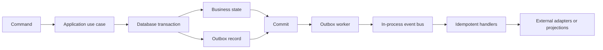

# Module Communication

## 1. Communication Selection

| Requirement                                                 | Mechanism                                |
| ----------------------------------------------------------- | ---------------------------------------- |
| The caller needs an immediate result or business validation | Synchronous application contract         |
| Logic stays inside one module and one transaction           | Domain event or direct domain method     |
| Another module reacts after a completed state change        | Integration event                        |
| A side effect must survive process failure                  | Transactional outbox                     |
| A read model or report can be updated later                 | Integration event and projection handler |
| Work must run at a future time                              | Persisted scheduled job                  |

A command changes state. A query returns data and must not change business state. An event describes a state change that has already completed; it is not a request for approval from another module.

## 2. Synchronous Application Contracts

- Synchronous calls are allowed only in the directions defined by `docs/architecture/module-boundaries.md`.
- A provider exports an application contract through a stable injection token.
- Contract inputs and outputs contain identifiers, primitives, value objects, or immutable snapshots. They never contain TypeORM entities.
- A consumer must not inject another module's controller, repository, or internal service.
- Business rejections are returned as explicit application errors. Infrastructure errors are not converted into successful results.
- A query contract must not create hidden writes or publish business events.
- The caller must not assume that an in-process contract can later become a remote call without redesigning its transaction and failure behavior.

TypeORM `EntityManager`, `QueryRunner`, or repository instances must not appear in a public module contract.

## 3. Events

### 3.1 Domain Events

Domain events are internal to one module. They represent meaningful changes inside an aggregate or use case and may coordinate handlers owned by the same module.

Domain events:

- Are named in the past tense.
- Do not cross a module boundary.
- May participate in the current transaction.
- Are converted into integration events when another module must react.

### 3.2 Integration Events

Integration events are the asynchronous public contracts between modules. Their approved business names are listed in `docs/architecture/module-boundaries.md`.

Integration events:

- Are immutable facts published after the producing transaction commits.
- Are persisted in the transactional outbox before publication.
- Use versioned payload schemas.
- Contain the minimum data required by consumers.
- Do not expose domain objects, TypeORM entities, credentials, tokens, or unnecessary identification details.
- Must be safe for duplicate and delayed delivery.

### 3.3 Event Envelope

Every integration event uses this logical envelope:

| Field              | Requirement                                       |
| ------------------ | ------------------------------------------------- |
| `eventId`          | Globally unique identifier                        |
| `eventName`        | Approved past-tense event name                    |
| `eventVersion`     | Positive schema version                           |
| `occurredAt`       | UTC timestamp of the business change              |
| `producer`         | Owning module name                                |
| `aggregateType`    | Type of the changed aggregate                     |
| `aggregateId`      | Identifier of the changed aggregate               |
| `aggregateVersion` | Monotonic aggregate version when ordering matters |
| `correlationId`    | Identifier shared by the complete operation       |
| `causationId`      | Command or event that caused this event           |
| `actorId`          | Authenticated actor identifier when available     |
| `payload`          | Versioned event-specific snapshot                 |

Adding optional fields is backward compatible. Removing, renaming, or changing the meaning of a field requires a new event version. Consumers must ignore unknown fields.

## 4. Transactions and Consistency

### 4.1 Transaction Ownership

One application use case owns each transaction boundary. Transactions normally update data owned by one module.

A cross-module transaction is allowed only when partial success would violate a business invariant. The initiating use case opens the transaction through an application-level transaction runner. Called module contracts participate in the existing transaction context without receiving TypeORM infrastructure objects.

The TypeORM implementation uses one `QueryRunner` for the complete transaction. Nested application calls join the current transaction and must not commit independently.

Business state changes and their outbox records are committed together. External HTTP, email, notification, and payment-provider calls must not run inside a database transaction.

### 4.2 Consistency Requirements

| Operation                                                                      | Required consistency                                                                       |
| ------------------------------------------------------------------------------ | ------------------------------------------------------------------------------------------ |
| Availability search                                                            | May use a current projection; the result is advisory until inventory is held or committed. |
| Reservation creation or confirmation with inventory allocation                 | Strong consistency in one transaction.                                                     |
| Reservation date change or cancellation with inventory release                 | Strong consistency in one transaction.                                                     |
| Room assignment, check-in, check-out, and room-status transition               | Strong consistency in one transaction.                                                     |
| Housekeeping completion and transition to `READY`                              | Strong consistency in one transaction.                                                     |
| Maintenance work creation or cancellation with a date-range availability block | Strong consistency in one transaction.                                                     |
| Deposit, payment, or refund recording                                          | Strong consistency with idempotent processing.                                             |
| Invoice issue and invoice snapshot creation                                    | Strong consistency in one transaction.                                                     |
| Notification delivery and reporting projections                                | Eventual consistency.                                                                      |

### 4.3 Concurrency Control

- Inventory mutations recheck availability inside the write transaction. A previous search result is never sufficient proof of availability.
- Inventory rows are locked in a deterministic room-type and date order to reduce deadlocks.
- PostgreSQL constraints protect uniqueness and non-overlap rules that can be expressed at the database level.
- Payment-provider references and idempotency keys use unique constraints.
- Invoice numbers use a database-enforced unique constraint.
- Non-critical aggregate edits use optimistic versions where concurrent updates are possible.
- A detected conflict returns a business conflict. It must not be silently overwritten.

## 5. Transactional Outbox

The outbox worker:

- Claims pending records with PostgreSQL locking that supports multiple worker processes.
- Publishes events through the in-process event bus.
- Provides at-least-once delivery, not exactly-once delivery.
- Records attempt count, next attempt time, and the last failure.
- Marks records as completed only after successful dispatch.
- Moves repeatedly failing records to a dead-letter state for operational review.

Each consumer processes an integration event in its own transaction. A consumer stores a unique receipt for `eventId` and handler name before applying a state change, so a retry cannot apply the same effect twice.

## 6. Idempotency, Retry, and Ordering

### 6.1 Idempotent Commands

Externally retryable commands, including reservation creation, payment recording, refund recording, and invoice issue, require an idempotency key.

The owning module stores the key, operation, actor or client scope, request hash, and final result. Reusing the same key with the same request returns the stored result. Reusing it with a different request returns a conflict.

### 6.2 Retry Policy

- Retry only transient infrastructure failures.
- Do not retry validation, authorization, availability, or other business rejections.
- Use bounded exponential backoff with jitter for background work.
- Preserve the correlation and causation identifiers on every retry.
- Expose dead-letter records and exhausted retries through operational monitoring.

### 6.3 Event Ordering

The system does not provide global event ordering. When ordering matters, a consumer compares `aggregateVersion` and processes events in aggregate order. Consumers must tolerate duplicates, delayed events, and events that arrive after a newer projection version.

## 7. Scheduled Work

Check-in reminders and other future work are stored as persistent jobs. In-memory timers are not authoritative.

Workers claim due jobs with database locks, execute them idempotently, and record completion or retry state. Rescheduling or cancellation updates the persisted job before the original due time.

## 8. Prohibited Communication Patterns

- Reading or writing another module's tables, repositories, or TypeORM entities.
- Creating a synchronous dependency not listed in the module dependency matrix.
- Creating bidirectional synchronous module dependencies.
- Using an event when the initiating use case requires an immediate decision.
- Publishing an integration event before its business transaction commits.
- Calling an external provider while holding a database transaction open.
- Passing TypeORM transaction objects through a module contract.
- Assuming event delivery is exactly once.
- Building reports by joining module-owned transactional tables directly.
