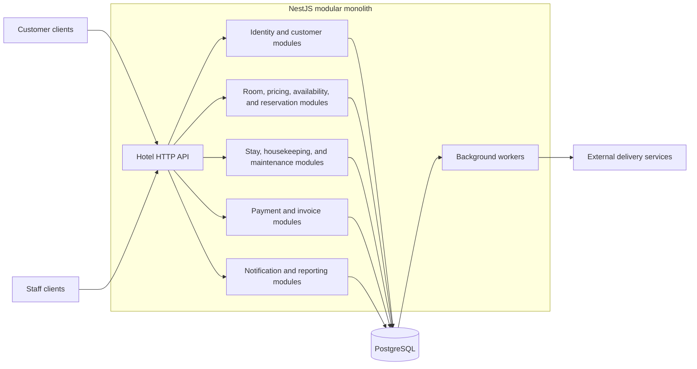

# Backend Architecture

## 1. System Context

The system is a backend for managing one hotel. It serves customers and hotel staff through HTTP APIs.

Customers can search for available rooms, view prices, make reservations, make payments, and manage their reservations. Staff users include administrators, hotel managers, receptionists, housekeeping staff, and maintenance staff.

The backend covers identity and access, room inventory, pricing, reservations, stays, payments, invoices, housekeeping, maintenance, notifications, and reporting.

## 2. Architecture Style

The backend is a modular monolith: one NestJS codebase divided into explicit business modules and backed by one PostgreSQL database.

Each module owns its business model and persistence mappings. A module must not directly use another module's TypeORM entities, repositories, or internal services. Modules communicate through exported application contracts or events.

The modular boundaries are designed to keep business concerns independent without introducing the operational complexity of distributed services.

## 3. Business Module Landscape

| Business area                  | Modules                                                            |
| ------------------------------ | ------------------------------------------------------------------ |
| Identity and customers         | `identity-access`, `customer`                                      |
| Rooms and commercial inventory | `room-catalog`, `pricing`, `inventory-availability`, `reservation` |
| Hotel operations               | `stay`, `housekeeping`, `maintenance`                              |
| Financial operations           | `payment`, `invoice`                                               |
| Supporting capabilities        | `notification`, `reporting`                                        |

Detailed module responsibilities, data ownership, public contracts, and dependency directions are defined in `docs/architecture/module-boundaries.md`.

## 4. Clean Architecture Strategy

Full Clean Architecture is used for modules with complex business rules or consistency requirements:

- `pricing`
- `inventory-availability`
- `reservation`
- `stay`
- `payment`
- `invoice`

Other modules may use a simplified structure while preserving the same module boundaries. Business logic must not be placed in controllers, TypeORM entities, or infrastructure adapters.

Detailed layer and folder rules are defined in `docs/architecture/code-structure.md`.

## 5. Technology Stack

| Concern                           | Technology or approach                      |
| --------------------------------- | ------------------------------------------- |
| Application framework             | NestJS 11                                   |
| Language                          | TypeScript                                  |
| HTTP platform                     | NestJS with Express                         |
| Database                          | PostgreSQL                                  |
| ORM and migrations                | TypeORM                                     |
| Authentication                    | JWT access tokens and refresh tokens        |
| Authorization                     | Role-based access control                   |
| Customer resource protection      | Ownership checks in application use cases   |
| Synchronous module communication  | Exported application contracts              |
| Asynchronous module communication | In-process events                           |
| Reliable external side effects    | Transactional outbox and background workers |
| External message broker           | Not used in the initial architecture        |
| Testing                           | Jest                                        |

## 6. Architecture Principles

| Principle                    | Rule                                                                                                                                            |
| ---------------------------- | ----------------------------------------------------------------------------------------------------------------------------------------------- |
| Business capability first    | Organize code by business module instead of global technical folders.                                                                           |
| Explicit data ownership      | Every business record has one owning module. Sharing a database does not allow direct access to another module's data model.                    |
| Dependency inversion         | Domain and application code must not depend on HTTP, TypeORM, or external providers.                                                            |
| Explicit module contracts    | Cross-module operations use exported application contracts or events. Internal services are not public APIs.                                    |
| Consistency by business need | Inventory and reservation changes use strong consistency and explicit concurrency control. Retryable side effects use the transactional outbox. |
| Security in use cases        | Transport guards enforce authentication and roles. Application use cases enforce customer ownership and business security rules.                |
| Observable operations        | Requests and background jobs use structured logs and correlation identifiers.                                                                   |

## 7. Architecture Documents

| Document                                      | Scope                                                                                     | Status  |
| --------------------------------------------- | ----------------------------------------------------------------------------------------- | ------- |
| `docs/backend-architecture.md`                | System context, architecture style, module landscape, technology stack, and principles    | Current |
| `docs/architecture/module-boundaries.md`      | Module responsibilities, data ownership, public contracts, events, and dependency matrix  | Current |
| `docs/architecture/module-communication.md`   | Synchronous communication, events, transactions, outbox, retries, and consistency         | Current |
| `docs/architecture/code-structure.md`         | Clean Architecture structure, simplified module structure, imports, and TypeORM placement | Current |
| `docs/architecture/security.md`               | Authentication, RBAC, ownership checks, and enforcement boundaries                        | Current |
| `docs/conventions/development-conventions.md` | Naming, DTOs, validation, errors, persistence, logging, configuration, and testing        | Current |
| `docs/flows/availability-and-reservation.md`  | Availability and reservation behavior                                                     | Planned |
| `docs/flows/stay-and-room-operations.md`      | Room assignment, check-in, check-out, cleaning, and maintenance behavior                  | Planned |
| `docs/flows/payment-and-invoice.md`           | Deposit, payment, refund, and invoice behavior                                            | Planned |
| `docs/decisions/README.md`                    | Architecture Decision Record index                                                        | Planned |
